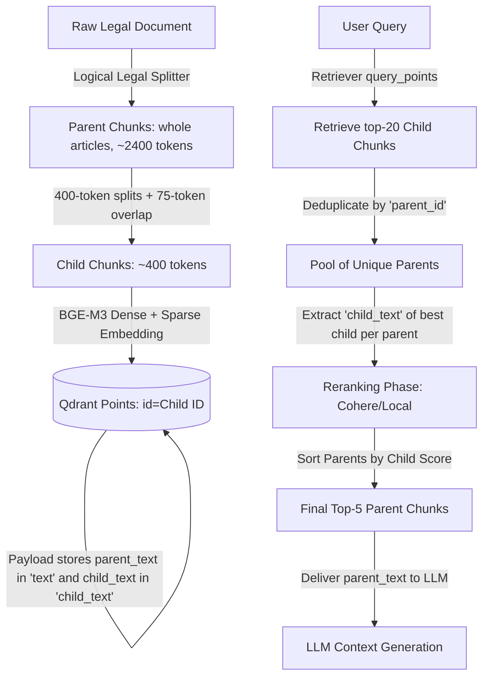

# Parent-Child Retrieval Architecture: Grilling Session & Decision Log

This document records the design decisions, architectural consensus, and concrete implementation blueprints established during the technical stress-testing session for the **Vietnamese Law Chatbot**'s transition to a Parent-Child (Small-to-Big) retrieval model.

---

## 1. Session Metadata
* **System Focus:** VectorRAG Pipeline & Data Ingestion (Qdrant + SQLite + BGE-M3 + local reranker)
* **Goal:** Solve "embedding dilution" in 2400-token chunks while maintaining robust macro-context for the LLM under a strict 5GB Docker RAM budget.
* **Methodology:** Systematic "grilling" of architectural choices against the existing codebase.

---

## 2. Grilling Q&A & Final Decisions

### Question 1: Resolving the Role of `cid` (Chunk ID)
* **The Problem:** The glossary in `CONTEXT.md` defines `cid` as a Qdrant Point ID, and `generator.py` uses `cid` to output citations `[ID: <cid>]`. If we search on Child chunks, returning Child Point IDs as `cid` would lead to fragmented, inconsistent citations for what is physically the same legal Article.
* **Decision:** **Map `parent_id` to the application-level `cid`.**
* **Architectural Consensus:** In Qdrant, the `point.id` is the Child ID. In the Qdrant payload, we store the `parent_id` inside the `"cid"` key. When the retriever returns results, it presents the `parent_id` as the document's `"cid"`. This ensures 100% backward compatibility with `generator.py` and `query_router.py` citations.

### Question 2: Reranking Chunks — Child Text vs. Parent Text
* **The Problem:** Under a Parent-Child approach, we fetch 400-token Child vectors but serve 2400-token Parent texts to the LLM. Should the reranker (local Vietnamese Reranker / Cohere Rerank) score the 400-token Child snippet or the massive 2400-token Parent?
* **Decision:** **Option A (Rerank Child Chunk).**
* **Architectural Consensus:** The retriever will deduplicate child search hits by `parent_id` *first*, keeping the highest-scoring Child per unique Parent. It will then pass the highly focused 400-token `child_text` to the reranker for maximum precision and extremely low latency, sorting the final parents based on their best child's reranked score.

### Question 3: Qdrant Point Schema & Payload Layout
* **The Problem:** How do we bridge the Child-to-Parent link inside Qdrant without adding a secondary slow database lookup?
* **Decision:** **Self-Contained Qdrant Payload Strategy.**
* **Architectural Consensus:** Leverage Qdrant's `ON_DISK_PAYLOAD=true` and `ScalarQuantization (INT8)`. We store each Child Chunk as a Qdrant point. The payload contains:
  ```json
  {
    "cid": 100240,                 // Parent ID (mapped to 'cid' for downstream compatibility)
    "child_cid": 999201,          // Real Child ID
    "text": "...parent text...",  // 2400-token Parent text (mapped to 'text' for the LLM)
    "child_text": "...snippet...",// 400-token Child text (for Reranker precision)
    "doc_id": 45                  // Document metadata
  }
  ```
  Duplicating `parent_text` across 5-6 children increases disk space by ~1.2GB but **consumes zero extra RAM**, making it extremely efficient and query-light (only 1 database query is needed).

### Question 4: Parent Chunk Boundaries — Naive vs. Logical Splitting
* **The Problem:** A naive character-limit chunker (e.g., 2400 tokens) will inevitably split an important legal Article (`Điều`) exactly down the middle across two separate chunks, causing the LLM to miss crucial clauses.
* **Decision:** **Logical Legal Splitting.**
* **Architectural Consensus:** The data pipeline will use a custom regex parser to split documents strictly on `Điều` (Article) boundaries. Small Articles will be batched together into a Parent Chunk (up to 2000-2400 tokens), and massive Articles will remain self-contained inside their own Parent Chunk. A single Article will never be sliced across two Parent Chunks.

### Question 5: Child Chunk Overlap Strategy
* **The Problem:** What overlap do we use when splitting a Parent Chunk into its 400-token Children?
* **Decision:** **75-token Overlap.**
* **Architectural Consensus:** A 75-token overlap (approx. 50-60 Vietnamese words) ensures that verbose legal sentences and clauses are not split awkwardly at boundary limits, maximizing vector query precision.

### Question 6: Validation and Golden Set Compatibility
* **Decision:** **Skip evaluation for now.**
* **Architectural Consensus:** Focus immediately on setting up the ingestion schema and updating the backend retriever logic. When evaluation is re-introduced, the golden set will remain 100% compatible because our returned `cid` is still mapped to the original 2400-token parent structure.

---

## 3. Data & Retrieval Flow Diagram



---

## 4. Implementation Step-by-Step Blueprint

### Step 1: Update the SQLite Schema
The Kaggle SQLite generation pipeline must write to this updated layout:
```sql
CREATE TABLE chunks (
    cid INTEGER PRIMARY KEY,           -- Child Chunk ID (integer)
    parent_id INTEGER,                 -- Parent Chunk ID (integer)
    text TEXT,                         -- Child Chunk Text (for embedding)
    parent_text TEXT,                  -- Full Parent Chunk Text (for LLM)
    dense_vector BLOB,                 -- 1024-dim Child Vector
    sparse_indices TEXT,               -- JSON array of indices
    sparse_values TEXT                 -- JSON array of values
);
```

### Step 2: Update `push_sqlite_to_qdrant.py`
Modify the payload packing loop to match the consensus schema:
```python
# data_pipelines/vector_rag/push_sqlite_to_qdrant.py — approx. Line 302
payload = {
    "cid": int(row["parent_id"]),       # Map parent ID to 'cid' so downstream reads it automatically
    "child_cid": int(row["cid"]),       # Keep child ID for trace
    "text": str(row["parent_text"]),    # Map parent text to 'text' for the LLM
    "child_text": str(row["text"]),     # Child text saved for the reranker
    "doc_id": int(row["doc_id"]) if "doc_id" in row.keys() else None,
    "title": str(row["title"] or "") if "title" in row.keys() else "",
    "so_ky_hieu": str(row["document_number"] or "") if "document_number" in row.keys() else "",
    "loai_van_ban": str(row["legal_type"] or "") if "legal_type" in row.keys() else "",
    "linh_vuc": str(row["legal_sectors"] or "") if "legal_sectors" in row.keys() else "",
    "co_quan_ban_hanh": str(row["issuing_authority"] or "") if "issuing_authority" in row.keys() else "",
    "ngay_ban_hanh": str(row["issuance_date"] or "") if "issuance_date" in row.keys() else "",
    "nguon_thu_thap": str(row["url"] or "") if "url" in row.keys() else "",
}
```

### Step 3: Update `retriever.py`
1. **Deduplication in `_hybrid_search`:**
   ```python
   # inside _hybrid_search() after query_points:
   merged: dict[str, dict] = {}
   for point in result.points:
       payload = point.payload or {}
       parent_id = str(payload.get("cid", point.id))
       score = point.score if point.score is not None else 0.0

       doc = {
           "cid":        parent_id,
           "id":         parent_id,
           "text":       payload.get("text", ""),        # Parent text
           "child_text": payload.get("child_text", ""),  # Child text for reranking
           "score":      score,
           "metadata":   {},
       }

       existing = merged.get(parent_id)
       if existing is None or score > existing.get("score", 0):
           merged[parent_id] = doc

   # Sort and return top unique parents (oversampled to allow diverse candidates)
   results = sorted(merged.values(), key=lambda d: d["score"], reverse=True)
   ```

2. **Scoring on Child Text in `_rerank`:**
   ```python
   # inside _rerank()
   docs_to_rerank = docs[:_RERANK_BATCH_SIZE]
   # Score on child_text if available, fallback to full text
   texts = [d.get("child_text", d.get("text", "")) for d in docs_to_rerank]
   
   # After local/Cohere reranker returns relevance scores, map them back:
   ranked = []
   for r in response.results:
       original_idx = valid_indices[r.index]
       ranked.append({
           **docs_to_rerank[original_idx],
           "score": r.relevance_score,  # Overwrite with reranked score
       })
   ```

---

## 5. Verification Checklist
- [ ] Parse Vietnamese legal corpus into SQLite using logical boundaries.
- [ ] Run `push_sqlite_to_qdrant.py --reset` to import Child Chunks.
- [ ] Execute diagnostic queries using `retriever.py` to verify that `child_text` is successfully extracted and sent to the reranker.
- [ ] Verify that `generator.py` correctly citations the unified `parent_id` in generated chat answers.
